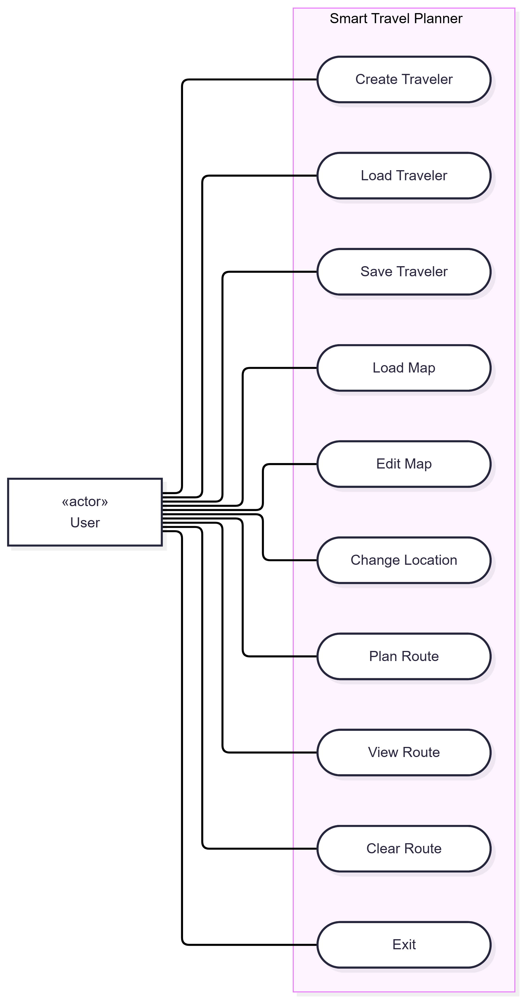
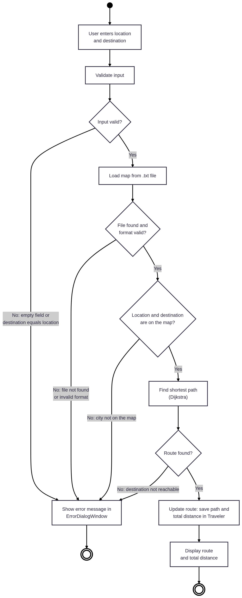
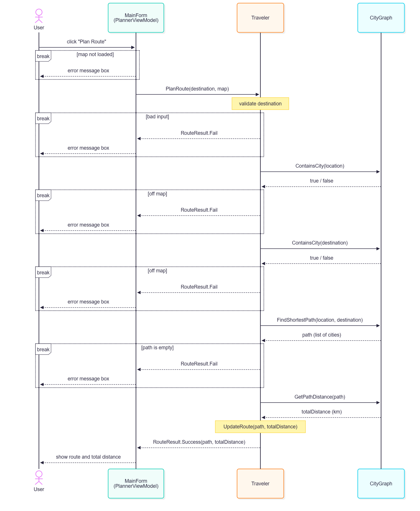

# SmartTravelPlanner

A desktop route planner built with C# / .NET 10 and Avalonia UI (MVVM). Create a traveler, load a map of cities, and get the shortest route between two cities using Dijkstra's algorithm.

## Table of Contents

- [SmartTravelPlanner](#smarttravelplanner)
  - [Table of Contents](#table-of-contents)
  - [Project Overview](#project-overview)
  - [UML Diagrams](#uml-diagrams)
    - [USE CASE Diagram](#use-case-diagram)
    - [ACTIVITY Diagram](#activity-diagram)
    - [SEQUENCE Diagram](#sequence-diagram)
  - [Requirements](#requirements)
  - [Build Instructions](#build-instructions)
  - [Run](#run)
  - [Usage](#usage)
  - [File Formats](#file-formats)
    - [Map file (`.txt`)](#map-file-txt)
    - [Traveler file (`.json`)](#traveler-file-json)
  - [Validation and Error Handling](#validation-and-error-handling)
  - [Architecture](#architecture)
  - [Project Structure](#project-structure)
  - [Code Quality \& Guidelines](#code-quality--guidelines)
  - [Tech Stack](#tech-stack)
  - [Development Notes](#development-notes)

## Project Overview

- **Traveler profile.** Create a traveler with a name and a current location, and change the location later.
- **Map loading.** Load a graph of cities and distances from a `.txt` file.
- **Shortest route.** Find the shortest path to a destination with Dijkstra's algorithm. The result shows every city on the route and the total distance in km.
- **Save / load state.** Store the traveler together with the planned route in a `.json` file and restore it later.
- **Manual map editing.** Add and remove connections between cities in a dedicated editor window, then apply the changes to the current map.
- **Clear route.** Reset the planned route and the destination field.

## UML Diagrams

### USE CASE Diagram

[](diagrams/usecase.png)

### ACTIVITY Diagram

[](diagrams/activity.png)

### SEQUENCE Diagram

[](diagrams/sequence.png)

In the sequence diagram, `MainForm` is the main application screen, implemented by `PlannerViewModel`.

## Requirements

- [.NET 10 SDK](https://dotnet.microsoft.com/download/dotnet/10.0)
- Windows, Linux or macOS (any platform supported by Avalonia)

## Build Instructions

From the repository root (`t00`):

```bash
dotnet build SmartTravelPlanner/Project.sln -c Release -m
```

The build is expected to finish in **under 30 seconds**.

The executable is produced in `SmartTravelPlanner/SmartTravelPlanner/bin/Release/net10.0/` (`SmartTravelPlanner.exe` on Windows, `SmartTravelPlanner` on Linux and macOS).

## Run

```bash
cd SmartTravelPlanner/SmartTravelPlanner
dotnet run -c Release
```

## Usage

1. On the **Hello!** screen enter a name and a location and press **Create Traveler**, or press **Load Saved Traveler** to open a `.json` profile.
2. Press **Load Map** and select a `.txt` map file (a sample is in `SmartTravelPlanner/SampleData/map.txt`). Use **Edit Map** to add or remove connections manually.
3. Optionally change your location with the **Change** button.
4. Enter a destination and press **Plan Route**. The route and total distance appear on the right. **Clear Route** resets them.
5. **Save** writes the traveler and the current route to a `.json` file. **Load** restores one, including the destination of the saved route. **Exit** closes the application.

## File Formats

### Map file (`.txt`)

One connection per non-empty line: `City1-City2,distance`.

```text
Kyiv-Lviv,540
Lviv-Warsaw,400
Warsaw-Berlin,300
```

- The distance is a whole number of kilometers greater than zero.
- Connections are bidirectional.
- City names are case-insensitive.
- If a city name contains a hyphen, surround the separator with spaces: `Ivano-Frankivsk - Lviv,130`.
- A connection that appears twice keeps the last distance.

With the sample map, `Kyiv → Berlin` gives `Kyiv → Lviv → Warsaw → Berlin`, 1240 km.

### Traveler file (`.json`)

```json
{
  "name": "Alice",
  "currentLocation": "Kyiv",
  "route": ["Kyiv", "Lviv", "Warsaw", "Berlin"],
  "totalDistance": 1240
}
```

## Validation and Error Handling

Input problems are shown in red directly under the affected field. The scenarios below additionally open an error message box:

| Scenario                                               | Example message                                                     |
| ------------------------------------------------------ | ------------------------------------------------------------------- |
| Map file not found or invalid format                   | `Map file not found.`                                               |
| Planning a route without a loaded map                  | `Map is not loaded. Load a map file first.`                         |
| Empty traveler field (name or location)                | `Name cannot be empty.`                                             |
| Empty destination                                      | `Destination cannot be empty.`                                      |
| Destination equals the current location                | `Destination must differ from the current location.`                |
| Destination (or current location) not on the map       | `Destination 'X' is not on the map.`                                |
| Destination not reachable                              | `Destination 'X' is not reachable from 'Y'.`                        |
| Invalid `.json` file on load                           | `Traveler file is empty or has an invalid format.`                  |
| Route no longer matches the edited or newly loaded map | `The planned route does not match the current map and was cleared.` |

Format rules are reported under the field: names and cities may contain letters, spaces, hyphens, apostrophes and dots, at least 2 letters and at most 50 characters; a distance in the map editor is a whole number from 1 to 100000. For the traveler's location, **Change** and **Save** additionally open a message box.

These limits apply to text typed in the application. A map loaded from a `.txt` file is validated by its own format rules (see [File Formats](#file-formats)) and is not limited by them, so a city name with digits in a map file cannot be typed in the application.

## Architecture

The project follows MVVM with a strict split between the domain layer and the UI:

- **Models** (`CityGraph`, `Traveler`, `RouteResult`, `Edge`) contain the domain logic, including Dijkstra's algorithm, traveler validation and JSON / text file handling. They have no UI dependencies.
- **ViewModels** hold UI state and commands (`CommunityToolkit.Mvvm`). They do not reference Avalonia types.
- **Views** (`.axaml`) are bound to view-models with data bindings. `MainWindow` switches between `StartView` and `PlannerView` through data templates.
- **`IWindowService`** abstracts dialogs (error box, file pickers, map editor), so view-models stay free of UI types and testable.
- **Services**: `InputValidator` holds the basic input rules (required values, distance); `FormValidator` adds the stricter UI-level format checks on top of them.

## Project Structure

```text
t00/
├── diagrams/                       UML diagrams
├── README.md
└── SmartTravelPlanner/
    ├── Project.sln
    ├── SampleData/map.txt          sample map
    └── SmartTravelPlanner/
        ├── Assets/                 application icon
        ├── Models/                 CityGraph, Traveler, RouteResult, Edge
        ├── Exceptions/             MapFormatException, TravelerFileException
        ├── Services/               InputValidator, FormValidator, IWindowService, WindowService
        ├── ViewModels/             Main, Start, Planner, MapEditor, Field, ConnectionItem
        ├── Views/                  MainWindow, StartView, PlannerView, MapEditorWindow, ErrorDialogWindow
        ├── App.axaml               theme and global styles
        ├── app.manifest            Windows application manifest
        ├── Program.cs
        └── SmartTravelPlanner.csproj
```

## Code Quality & Guidelines

- The code follows the official [Microsoft C# coding conventions](https://learn.microsoft.com/dotnet/csharp/fundamentals/coding-style/coding-conventions) and clean-code principles: small single-purpose methods, meaningful names, no duplicated logic, and a clear separation of concerns.
- Nullable reference types are enabled across the project.
- Resources are managed correctly: file access goes through `System.IO.File` APIs that release handles immediately, picked `IStorageFile` objects are disposed after use, I/O errors are converted to domain exceptions (`MapFormatException`, `TravelerFileException`), and there are no lingering event subscriptions or view references held by view-models, so there are no memory leaks.
- View-models do not reference Avalonia types; closing the map editor window is passed to its view-model as a callback.
- Exceptions are used for exceptional conditions only; expected failures (for example an unreachable destination) are returned as a `RouteResult`.

## Tech Stack

| Component                              | Version            |
| -------------------------------------- | ------------------ |
| .NET                                   | 10                 |
| Avalonia UI (Fluent theme, Inter font) | 12.1.3             |
| CommunityToolkit.Mvvm                  | 8.4.2              |
| Serialization                          | `System.Text.Json` |

## Development Notes

To preview a view in VS Code: build the solution, open an `.axaml` file, press `Ctrl+Shift+P` and run **Avalonia: Show Previewer to the Side**.
